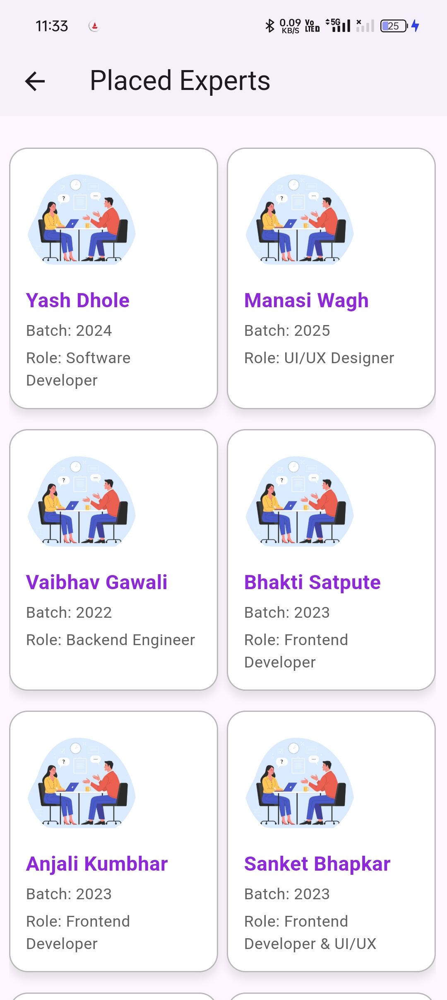

# 🎯 Career Map

Career Map is a Flutter-based mobile application designed to help students prepare for placements effectively.  
It provides detailed company information, aptitude and interview preparation, GD (Group Discussion) materials, quizzes with scoring, and even integrates a JDoodle Java compiler for coding practice — all in one place.

---

## 🧭 Features

- 🏢 **Company Info:**  
  View visiting company details like name, visit date, founder, revenue, and more.
  
- 🧮 **Aptitude Preparation:**  
  Access aptitude questions, explanations, and practice materials.
  
- 💬 **Interview & GD Preparation:**  
  Get curated questions and video links to prepare for interviews and group discussions.
  
- 🎥 **YouTube Integration:**  
  Launch YouTube videos directly from the app using `url_launcher`.

- 🧠 **Quizzes:**  
  Interactive quizzes with real-time scoring and tracking.

- 💻 **JDoodle Compiler Integration:**  
  Write and run Java code directly inside the app using JDoodle API.

- 👨‍🏫 **(Future Feature)** Chat with experts for career guidance.

---

## 🏗️ Tech Stack

| Category | Technology |
|-----------|-------------|
| **Framework** | Flutter |
| **Language** | Dart |
| **State Management** | Provider |
| **Backend/Compiler API** | JDoodle |
| **Plugins Used** | `url_launcher`, `provider`, `http`, etc. |
| **IDE** | Android Studio / VS Code |

---

## 📱 Screenshots

Below are some screenshots of the **Career Map** app.  

## Screenshots

| Feature       | Preview                    |
|---------------|----------------------------|
| Home Screen   |  |


<!-- ```markdown -->
###  Login Page

    

###  SignUp Page


###  Home Page


###  Company Description Page


###  Study Section Page


###  Aptitude Section


###  Aptitude-Lecture Section


###  Aptitude-Question Section


###  Aptitude-Quiz Section


###  Coding Section


###  Compiler Section


###  Coding Solution Section

                            

###  Interview Section


###  Interview Preparation


###  Chat with Expert


